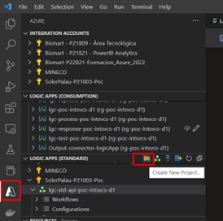

# Como usar Logic Apps Standard en Visual Studio Code

## Requisitos Iniciales 

Instalar .NET Core 3.1 i .NET 6.0

https://dotnet.microsoft.com/es-es/download/dotnet

Instalar extensiones de VS CODE:

- .NET Watch Attach
- AzuriteDev:
- Azure Functions
- Azure Logic Apps (Standard)

## Guía paso a paso

Inicializar proyecto, Crear repo en DevOps/GitHub i vincular.

Para inicializar proyecto, seleccionar en el botón de Azure, Logic Apps (STANDARD) y crear nuevo proyecto.

 

Una vez creado el proyecto, se pueden ir creando tantos flujos como se necesite. (botón a la derecha del de crear proyecto)

Cada flujo se puede visualizar en forma de código (predeterminado) o en modo “No code” haciendo click derecho en el JSON del workflow i Abrir en Designer.

 

Para debug (ejecución en local), pulsar el botón de Run en el menú superior y start debugging. 
NOTA: Antes se tiene que haber inicializado los servicios de la extension "azurite"

 

Para revisar registros de ejecución y resultados (Overview), click derecho en el JSON del workflow a revisar y seleccionar la opción de Overview. Se muestra una pantalla con el historiar de ejecución y la URL que se tiene que llamar para ejecutar la Logic App.

 

Para hacer un deploy, pulsar el botón de deploy de la extensión de logicApps. Se deberá seleccionar la suscripción y la logic app que se va a sobreescribir.

 

También se puede configurar el deploy directamente desde Azure (deploy automático al hacer commit).

Se configura desde la Logic App en el portal de Azure, en el apartado de Deployment center. Se deberá seleccionar el origen, repositorio, rama, … 

 

Para el deploy automático se necesita añadir un fichero llamado package.json del estilo:

 
